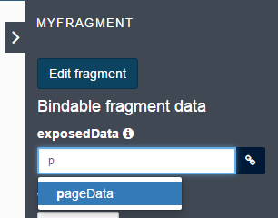

# Fragments

A fragment is a piece of a page, composed of one or more widgets. It can be inserted in other pages. A fragment has its own widget configurations and data, but can also expose data to the pages that includes it.

Fragments are available in the Bonita BPM Performance, Efficiency, and Teamwork editions.

## Fragment editor

The editor used to create or update a fragment is the same as the Page editor. Create and update fragments in the same way as you create and update a page. 

## Create a fragment

You can create a fragment from scratch from the the UI designer home page. 

1. Specify a name in the area called New fragment.
2. Click the **_Create_** button. 
3. The fragment editor opens.

Any container used in a page or a fragment can be converted into a fragment. 

1. Select the container in the page editor.
2. Click the link **Save as fragment** in the properties sidebar.
3. Specify a name.
4. Click the **_Save_** button. 
5. The Fragment editor opens.

## Update a fragment

Fragments are listed on the UI designer home page. Click the name of a fragment to open it in the Fragment editor.

You can also update a fragment in the page editor when you are editing a page that uses the fragment. Select the fragment in the Page editor and click the **_Edit fragment_** button. The changes you make to the fragment are applied everywhere that the fragment is used, not just the page you are currently editing. 

## Variables and fragments

A fragment has its own variables, but can also expose variables to the pages that include it.

When you add a variable to a fragment, specify whether the variable will be exposed in the pages using this fragment. 

* If a fragment variable is not exposed, the variable data is specific to the fragment.
* If a fragment variable is exposed, it can be bound to a variable of a page that embeds the fragment. 

For example, take a fragment called "MyFragment". This fragment has two variables, one exposed (exposedVariable) and the other not (notExposedVariable). When you add this fragment to a page in the Page editor, you can bind the exposedVariable with a variable defined in by the page.

At runtime, when fragment and page variables are bound, data changes can be made in either the page or the fragment. 

If several fragments expose a variable and these variables are linked to the same page variable, if you change the variable in the page, or in one of the fragments, the change is made in all the fragments.

## Export a fragment

A fragment can be exported from the UI designer home page. The fragment is exported as a zip file that contains the following:

* an HTML page
* a resources folder containing
  * CSS files
  * JavaScript dependencies
  * Widget files used by the fragment (a widget is an Angular JS directive)
  * any sub-fragments that are used

You can use the HTML page as it is. You can also update the code outside the UI designer. However, if you make changes that are not compatible with the UI designer, you will not be able to import the fragment back into the UI designer.

## Import a fragment 

You can import a fragment into the UI designer. 

The format of the imported zip file must be the same as the UI designer builds for an export. 
If the fragment is already in the designer, the version of the fragment in the UI designer and any the custom widgets used by this fragment are erased by the imported objects. If you have updated the HTML code, the CSS files, or JavaScript of the fragment, your modifications are not imported into the UI designer.
