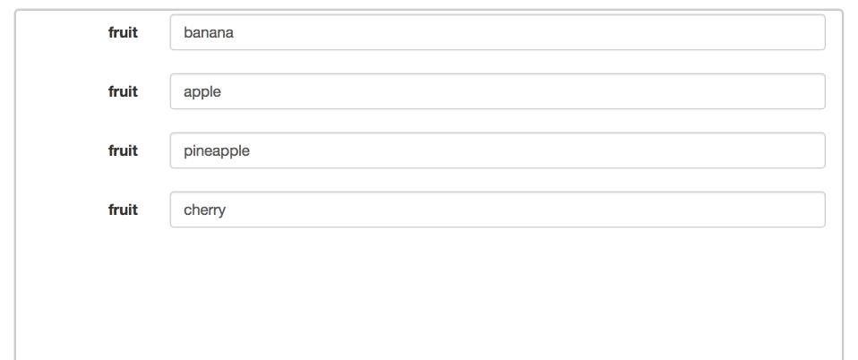
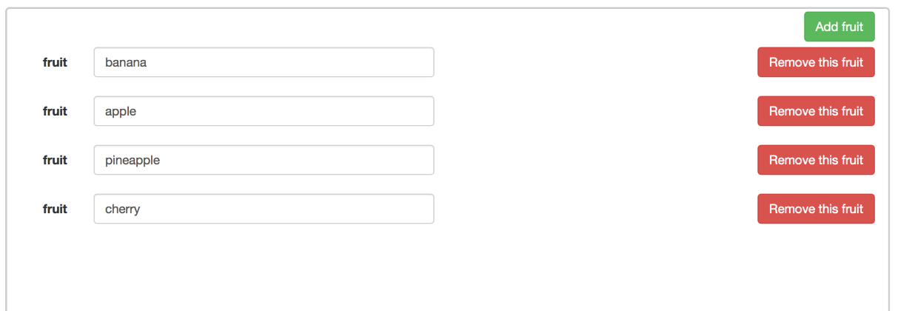
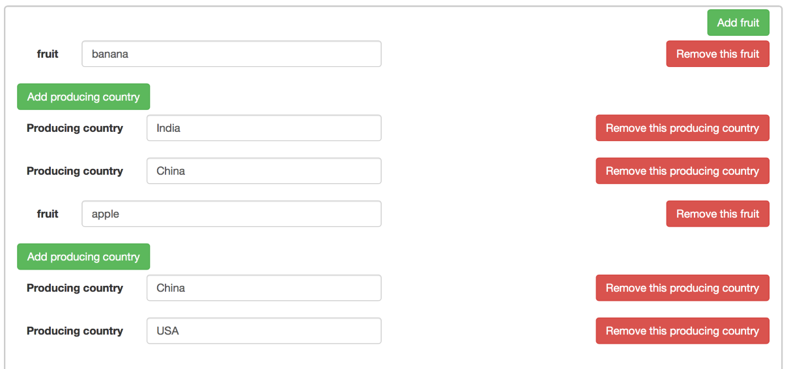

# 1.7.2.5 Repeat a container for a collection of data

The content of a container can be included multiple times in a page, once for each element in a collection of data. The content is repeated as many times as necessary to display all the data in the collection.

A collection is an array of data referenced by a variable. The UI Designer provides some built-in variables that you can use to specify the collection or an element within it:

* _$index_: the index of the current iteration of the collection (counting from zero)
* _$item_: the element of the current iteration
* _$collection_: the current collection (not available in releases earlier than 7.1.3)

The rest of this page contains some examples of how to repeat the content of a container over a collection.

[Simple collection](#simple-repeat-contents)  
[Modifiable simple collection](#simple-repeat-contents)  
[Structured collection](#structured-repeat-contents)  
[Nested collections](#structured-repeat-contents)

Follow the examples in sequence, because each one builds on the previous example.

## Simple collection

This section explains how display the elements from a simple collection in a repeatable container.

In this example, the collection of data is a list of fruits. You want to display this list in a table and enables users to modify the name of a fruit. To create the table in a page: 

1. In a UI designer page, create a variable to specify the collection, which must be an array. 
In a typical application, a collection is defined by a JavaScript or External API variable, but for easy page development, you can use a fixed JSON array. 
For this example, create a JSON variable called _fruits_ containing `["banana","apple","pineapple","cherry"]`.
2. Add a container widget to your page and bind the variable _fruits_ to the **Repeat contents** property.
3. In the container, add an input widget with the following properties:
  * Bind the **Value** property to _$item_.
  * Set the **Label** property to _Fruit type_.
  * Set the **Label position** property to _Left_.
4. Check the Preview, which should look something like this:

A user can modify the name of a fruit by typing in the input field.

## Modifiable simple collection

This section shows how to update the container that you defined in the previous section, to enable the user to add an element to a collection or to remove an element. 
Adding an element adds a repeat of the container content. Removing an element removes the repeat.

1. In the page, add a button widget above the container (not in the container) the following properties:
  * **Label**: _Add a fruit_
  * **Alignment**: _right_
  * **Style**: _success_
  * **Action**: _Add to collection_
  * **Collection**: _fruits_
  * **Add**: _Last_, to add the new item at the end of the collection
  * **Value to add**: leave this empty because there is no specific structure to add
2. In the container, add a button widget on the same line as the input widget labelled Fruit type, with the following properties:
  * **Label**: _Remove this fruit_
  * **Alignment**: _right_
  * **Style**: _danger_
  * **Action**: _Remove from collection_
  * **Collection**: _$collection_, to point to the current collection, fruits
  * **Remove**: _Item_, to remove the current item related to this line
  * **Item to remove**: _$item_, to reference the current element
3. Check the Preview, which should look something like this:

A user can now add a new fruit or remove a fruit, dynamically changing the collection.

## Structured collection

This section explains how to update the container to display a structured collection using repeated content. 
The previous examples used a simple array of names of fruits, where each item was a primitive String type. 
This example uses a more complex array with a list of producing countries nested within each item in the list of fruits. It has the following structure:

    {
       "fruit":"fruit name",
       "producingCountries":
                   ["country1","country2"]
    }
    

1. Create a new variable,_fruitsProducingCountries_, with the following value: 

    [
      {
       "fruit":"banana",
       "producingCountries":
                   ["India","China"]
       },
       {
        "fruit":"apple",
        "producingCountries":
                    ["China","USA"]
        }
    ]
    

2. Select the container and change the **Repeat contents** property so that it binds to _fruitsProducingCountries_ instead of to _fruits_.
3. Select the input widget that displays the fruit and change the **Value** property to bind to _$item.fruit_.
4. Select the _Add fruit_ button and change the **Collection** property to bind to _fruitsProducingCountries_.
5. Check the Preview. You see the same result as in the previous example.
The country information is present in the data collection but is not displayed. You can still change the name of a fruit, and add or remove an entry.

## Nested collections

This section explains how to update the container configuration to handle a structured collection that includes nested structures, to enable a user to add or remove elements at any level of the collection. 
The updated page displays the producing countries for each fruit. A user can rename, add, or remove a fruit, and add or remove a producing country for a fruit.

1. Add a button widget in the existing container, below the row that contains the _Fruit type_ input widget and the _Remove this fruit_ button. Configure the button widget properties as follows:
  * **Label**: _Add producing country_
  * **Alignment**: _left_
  * **Style**: _success_
  * **Action**: _Add to collection_
  * **Collection**: _$item.producingCountries_, to specify the element of the data structure to which the element is added
  * **Add**: _Last_, to add the new item is added at the end of the collection
  * **Value to add**: leave this empty because there is no specific structure to add
2. Add a new Container widget inside the existing container below the _Add producing country_ button. 
3. To repeat the content of this new container for the collection of producing countries associated with each fruit type, bind the **Repeat contents** property of this container to _$item.producingCountries_. 
4. Add an input widget in the new container to display the producing countries. Set the widget properties as follows:
  * **Label**: _Producing country_
  * **Label position**: _left_
  * **Value**: bind to _$item_, to specify the current item within the collection _producingCountries_.
5. To enable the user to remove a producing country item, add a button widget in the container in the same row as the _Producing country_ input widget. Configure the button widget properties as follows:
  * **Label**: _Remove this producing country_
  * **Alignment**: _righ_
  * **Style**: _danger_
  * **Action**: _Remove from collection_
  * **Collection**: _$collection_, to specify the current collection, producingCountries 
(you could also specify the collection explicitly as _fruitsProducingCountries.producingCountries_, but for better maintainability this is not recommended because
if you specify the collection explicitly and subsequently change the collection name or the parent collection name, you need to remember to update this property setting)
  * **Remove**: _Item_, to remove the current item related to this line
  * **Item to remove**: _$item_, to specify the current element
6. Check the Preview, which should look something like this:

You can rename, add, and remove fruits, and add or remove countries, dynamically changing the structure of your collection.