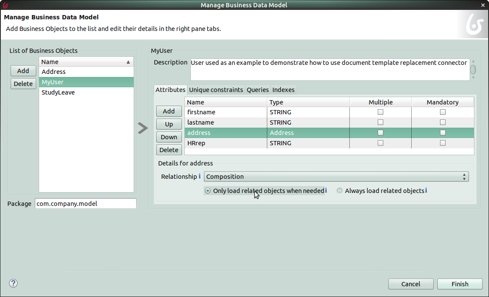
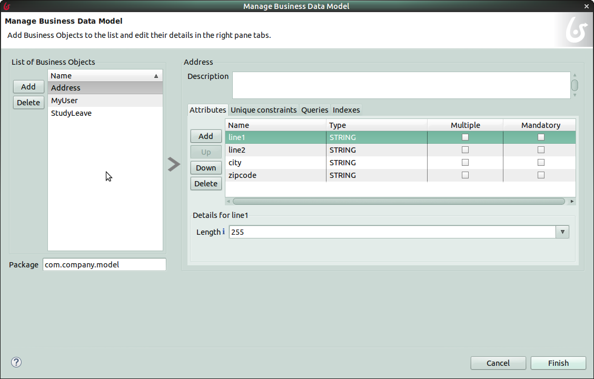
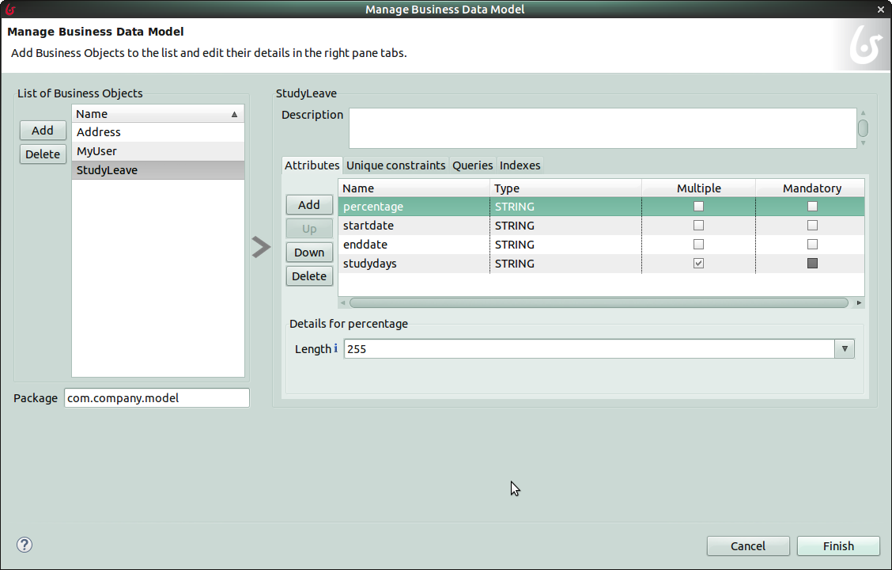
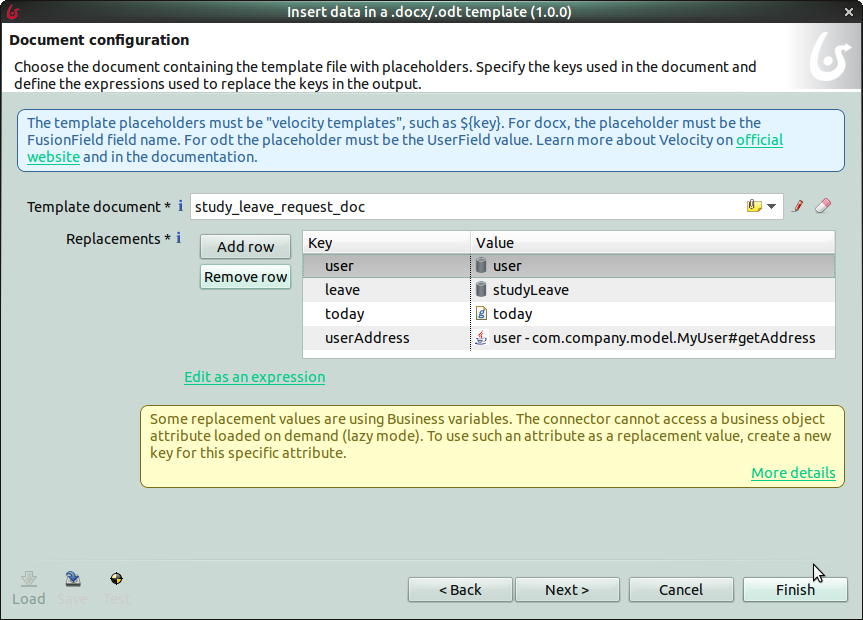
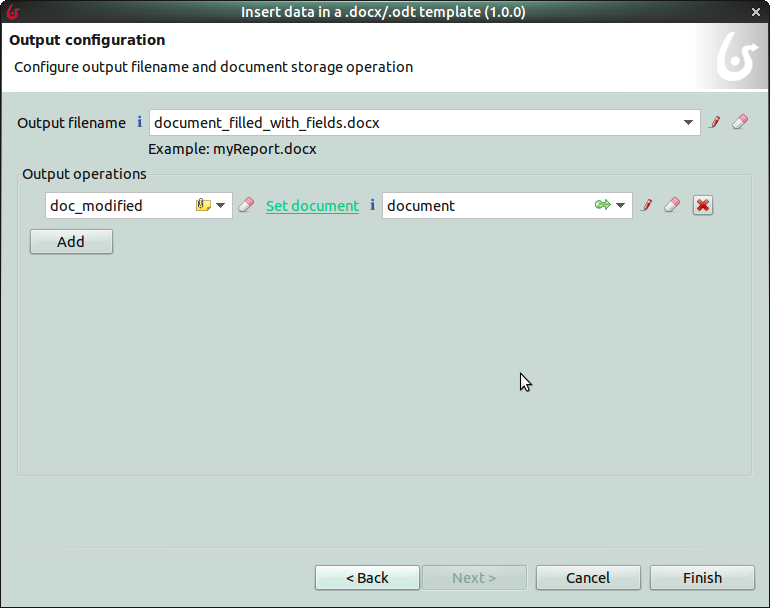

# Insert data in a .docx/.odt template

::: alert alert-info
**Note:** For Performance, Efficiency, and Teamwork editions only.
:::

The **insert data in a .docx/.odt template** connector allows to fill a specified template file by inserting values coming from the current process instance, for example from a form attached to a human task.

The template is a LibreOffice/OpenOffice `.odt` file or a Microsoft Word`.docx` file with special placeholders called `keys`.  
A key is a replaceable element in the template that is identified with a dollar sign and surrounded by braces, (eg. ${element}), following the [Velocity Template Language](https://velocity.apache.org/engine/releases/velocity-1.7/user-guide.html).

To configure the connector for a task, add a connector (in or out) to the task, choose the "Office" category, and select "insert data in a .dox/odt template".

In the connector configuration, the keys are mapped to variables from the process or from any other data source.  
At some point in the process instance, the template file must be set as the content of a document created at pool level.  
When the connector runs, it creates a file based on the template and inserts the current values of the relevant variables into the appropriate placeholders (keys) in the file.  
The generated file can replace the template in the same document or be stored in another document of the process. A common usage is to send the document by email or store it in an external information system using another connector.

## How to insert `keys` in a template file

### Using Word (docx) - Tested versions are **Microsoft Word 2007/2010**, may work on later versions

#### Create a `field`

* Insertion \> QuickPart \> Field...
* Select FusionField (or MergeField in some Word versions) and use a template (see Velocity templating language) as field name (eg: ${name}, ${user.Name}...etc)
* Click OK

#### Updating an existing `key`

* Right click on the Fusionfield to edit
* Click on Update field...

### Using LibreOffice (odt)

* Insert \> Fields \> More fields...
* Go to Variables tab, select UserField and use a template (see Velocity templating language) as value (eg: ${name}, ${user.Name}...etc)
* Choose Text format
* Click Insert  
For further information about the template design, [click here](https://code.google.com/p/xdocreport/wiki/DesignReport)
**Warning:** there is a known issue when adding an image in a .docx using drag'n'drop instead of a copy/paste. The image is not rendered properly if you convert the generated file into PDF.

## Example of template using key values taken from a business variable

### Business Data model used in the example

Here is a [template example](images/special_code/study-leave-template.docx) for Leave Request submission and approval.   
This .docx file uses keys, most of which will be replaced by values from business variables created from the following **Business Data Model**:

  

  

  

### Connector configuration

The configuration is as follows:  
  


In this example, the key named `user` is mapped to the business variable `user`, the key named `leave` is mapped to the business variable `studyLeave`, and the key named `today` is mapped to a groovy script expression with the following content:

```groovy
        import java.text.SimpleDateFormat;
        new SimpleDateFormat("yyyy/MM/dd").format(new Date())
```
  
* If the keys are mapped with complex objects, pass the high level object to the mapping (eg. **'user'**). The connector will handle the sub-structure of this complex object (eg. **${user.firstName}**)
* When using business variables, relations "loaded when needed" (lazy mode) are not loaded in a connector execution context. To use such relations, create new keys, like "userAddress" in the above example.
* If the replacement value is null, then the field key will be rendered (eg. **${userAddress.line2}**). Use a "!" mark to render blank value, like **$!{userAddress.line2}** if userAddress.line2 may be null.

And the output file mapping:  

  

In this business example, the requesting user enters personal information in a process form. In a subsequent step, the reviewing user adds Approval information. The entered values are then provided as inputs to the **insert data in a .docx/.odt template connector** to replace the keys.  
The generated output file is then stored in a document of the process.  
This connector is built upon **XdocReport** third party library, for more information check their Wiki at [https://github.com/opensagres/xdocreport/wiki](https://github.com/opensagres/xdocreport/wiki)  
You will find out advanced report design documentation:

* [Loop for keys in table rows](https://github.com/opensagres/xdocreport/wiki/DocxReportingJavaMainListFieldAdvancedTable)
* [Use a MS Word macro to design the report](https://github.com/opensagres/xdocreport/wiki/DocxDesignReportMacro)
* [Report samples](https://github.com/opensagres/xdocreport.samples)
* ...
