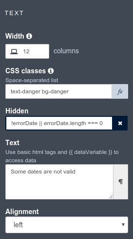
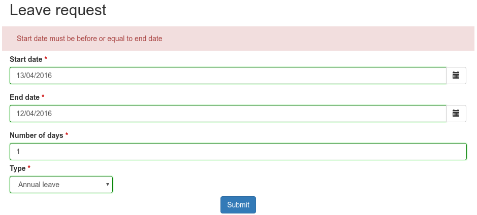
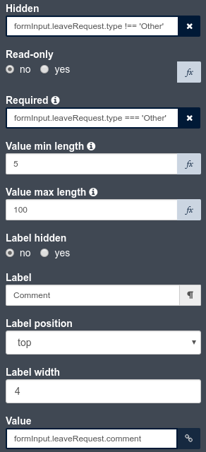
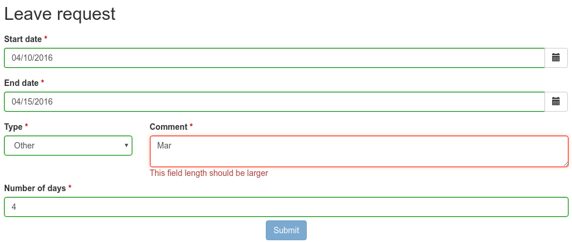

# Form control/validation in the UI Designer

Using a leave request management process example, you will learn how to take advantage of forms in the UI Designer and how to add validation for the data to submit.

## Prologue

You will design a simple leave request management process using Bonita BPM 7 and beyond:
First things first, draw the wireframe of the process. In Bonita BPM Studio, since the instantiation of a new leave request happens at pool level, add a simple validation task, rename the pool _Leave request management_, and rename the lane _manager_, as shown here: 


Then, define a business object that will hold the leave requests data when the process instances are ongoing, and store it when the instances are archived:
In Bonita BPM Studio menu, go to **Development** > **Business Data Model** > **Manage** option, and add a business object named _LeaveRequest_, with 4 attributes:
* _startDate_: first working day taken as vacation
* _endDate_: last working day taken as vacation
* _nbDays_: number of working days taken as vacation
* _type_: leave type (annual leave, anticipated leave,...)

To allow this business object to be instantiated in each process instance, create a business variable in the process:
At pool level, in the **Data** panel, define a **business variable** named _leaveRequest_. For **business object**, choose **LeaveRequest**.

Then, to make sure the process gets the information it needs to start a new instance, create a contract:
In the **Execution** pane > **Contract** tab, click the **Add from data...** button to generate the contract input from an existing business variable. Choose the **Business variable** option, and the **leaveRequest** variable. 
A complex contract input is created, mapped on the _leaveRequest_ business variable.

Each entry of the contract is bound to a business object property:
* _startDate_ as a **DATE**
* _endDate_ as a **DATE**
* _nbDays_ as an **INTEGER**
* _type_ as **TEXT**

... as shown here:


You can also add constraints on the contract inputs in the **Constraints** tab.

For more information about process, business data management and contract, check out [**Designing Efficient BPM Applications: A Process-Based Guide for Beginners**](http://shop.oreilly.com/product/0636920039402.do).

To generate an instantiation form that complies with the contract (where the user will start a new request), go to the **Instantiation Form** tab, and click on the pen icon. This will take you to an open form in the UI Designer.
By default, this form contains a **form container** with 4 **widgets** matching the contract:

* a **date picker** widget for the start date
* a **date picker** widget for the end date
* an **input** widget expecting a number for the number of days
* an **input** widget expecting text for the type

... as shown here: 


You can check what it will look like once deployed by clicking on **Preview**, as shown here:


## Basic contract validation and constraints
You can notice that:

- Every field label is followed with a red star showing that those fields are required (by the contract).
- The **Submit** button is disabled until all fields marked as required are filled.

If one of the input constraints is invalid, an error message is displayed below the input field. In the example, the only input constraint is **required**, so an error message is displayed if you edit and reset a field, as shown here: 


Once all fields have values, the form can be submitted, the contract validated by the process, and the new process instance can be started.

## Advanced contract validation and constraints

### More visible information of invalid inputs

Now, to alert the user that an input is not valid with a red border around invalid inputs, you must use the AngularJS **form control properties**.

#### AngularJS $form

Inside a form container, AngularJS provides a special variable called **$form**.  
This variable holds the validation state of the inputs, selects and textareas of the current form container. 

Here is an extract from the [AngularJS documentation site](https://docs.angularjs.org/guide/forms) that explains the purpose of this feature.

>From an AngularJS point of view, a form is a collection of controls for the purpose of grouping related controls together.
>
>Form and controls provide validation services, so that the user can be notified of invalid input before submitting a form. This provides a better user experience than server-side validation alone because the user gets instant feedback on how to correct the error.

A control in AngularJS exposes properties for a given input, select or textarea and associates it with a CSS class:
- $dirty (CSS class _ng-dirty_): the control has been interacted with
- $pristine (CSS class _ng-pristine_): the control hasn't been interacted with yet
- $valid (CSS class _ng-valid_): the model is valid
- $invalid (CSS class _ng-invalid_): the model is invalid

_Note_: In this example, we will only focus on these properties. More properties and information about form control is available on [AngularJS form guide](https://docs.angularjs.org/guide/forms).

AngularJS sets these different CSS classes on HTML input elements depending on their states. 

#### Using AngularJS form control CSS classes

_Note_: A dedicated tutorial about [CSS assets in the UI Designer](tuto-de-camille-CSS.html) is available and we recommand to read it before you go further in this tutorial.

So, to alert users about the invalidity of inputs they just edited, you need to use _ng-invalid_ and _ng-dirty_ classes on those elements:  
In your favorite editor, create a _validationStyle.css_ file containing the class below:

```css
.ng-invalid.ng-dirty {
   border-color: red;
   outline: 0;
   -webkit-box-shadow: inset 0 1px 1px rgba(0,0,0,.075),0 0 8px rgba(233,175,102,.6);
   box-shadow: inset 0 1px 1px rgba(0,0,0,.075),0 0 8px rgba(233,175,102,.6);
}
```

Using only the _ng-invalid_ class makes red border appear even before the user enters a value for the input and that is annoying.
Then, in the form **Assets** panel at the bottom, click **Add** and add the CSS file.
In the same way, to show the user which inputs are valid, edit the CSS file to add:

```css
.ng-valid {
   border-color: green;
   outline: 0;
   -webkit-box-shadow: inset 0 1px 1px rgba(0,0,0,.075),0 0 4px rgba(102,233,102,.6);
   box-shadow: inset 0 1px 1px rgba(0,0,0,.075),0 0 4px rgba(102,233,102,.6);
 }
```

In the UI Designer preview, the form looks like it is shown here:


_Note_: The properties of the form controls also apply to the $form variable.  
So in this case, the $form variable has the properties $invalid, $valid, $pristine and $dirty dependending on the value of each of its controls: if one of the controls has a property set to true then the $form matching property is set to true.
Therefore, the HTML form element has the associated ng-pristine, ng-dirty, ng-valid and ng-invalid classes set whether the $form properties are true or false.  
Since the HTML form element has no border, the CSS classes added have no impact on it.

### Error summary panel _(SP only)_

For debug purposes, you can add a panel at the top of the form to list all errors in the form:
From the UI Designer home page, create a **fragment**. Set _errorPanel_ as the fragment name. In the **Variable** panel at the bottom, create one variable, of type **exposed: yes**, called _errors_. Create two other variables, of type **exposed: no**: 

 * errorRequired: it allows to tell if in the form, some required data are missing.
 * errorDate: it allows to tell if in the form, some dates are invalid.

These two variables are instantiated with JavaScript expressions using $form.$error. 
Therefore, for **Type**, select **JavaScript expression**.
For _errorRequired_ , enter the following **Value**:

```javascript
return ($data.errors.required || []).filter(function(field){
    return field.$dirty;
  }).map(function(field){
    return field.$name;
  });
```

And for _errorDate_, enter:

```javascript
return ($data.errors.date || []).map(function(field){
    return field.$name;
  });
```

The _errorRequired_ is a bit different from _errorDate_ because when the form is empty, the user doesn't need to be reminded that some fields are empty. This is why it contains a filter to only display the errors on dirty fields (i.e. which have been edited).

These two variables will contain the list of invalid widget names.
Currently, these widget names are not usable directly because they are automatically generated. 
Therefore, from the palette on the left, drag and drop two **text** widgets in this fragment whiteboard, with the following text: 

 * Some required data is missing.
 * Some dates are invalid.

To put the text and the background in red, add the bootstrap's _text-danger_ and _bg-danger_ CSS classes in the **CSS classes** property for both widgets. 
To hide these fields when no error are detected, go to the **Hide** property of each widget, click on **f(x)** to make them evaluated as expressions, and add respectively: 

 * _!errorRequired || errorRequired.length === 0_
 * _!errorDate || errorDate.length === 0_

... as shown here:

 

Then, to change the default style of the **p** html tag and have a little more margin, open the _validationStyle.css_ file and add the following:

```css
.text-danger p {
  margin: 1em;
}
```

Go back to the home page, and then open the leave request form again.
From the palette, add a **title** widget to the top of the form. In the **text** property, write _Leave request_.  
In the palette on the left, select **Fragments**, and then drag and drop the fragment just created below the form title, as shown here (from the preview):


### Use a **select** widget for the leave type

The user usually selects one option of leave type and does not type free text. A predefined list of such values could be:

 * Annual leave
 * Anticipated annual leave
 * Unpaid
 * Other

To implement such a list, remove the generated input widget for **type** and add a **select** widget with the following properties:

 * Label: _Type_
 * Required: _yes_
 * Placeholder: _type_
 * Available values: _Annual leave, Anticipated annual leave, Unpaid, Other_
 * Value: _formOutput.typeContract_

## Custom validation

### Use contract response for server side validation

At this stage, you have added some simple control over the different inputs. You will now learn about more advanced validation checks. For example, let's express those three rules: 
 * The start date must be earlier or the same than the end date
 * The number of days must be greater than zero
 * The leave type must be one of Annual leave, Anticipated annual leave, Unpaid, or Other.

For the second requirement, you have already set a control on the input
For the last requirement: you have already changed the widget type from **input** to **select**.  
Therefore, on those two fields, a user cannot submit wrong data.  

However, keep in mind that while client-side validation plays an important role in providing a good user experience, it can easily be circumvented and therefore can not be trusted. 
Server-side validation is still necessary for a secure application.

For this reason, we need to add some constraints to the contract, process side, one for each rule.  
Go back to the Studio, and at pool level, go to the **Execution** pane > **Contract** > **Constraints** tabs to define the constraints as shown here:


The server error response message on submit when one of the constraints fails has an _explanations_ attribute.  
This attribute is an array of the error message of each constraint that has failed.

On the UI Designer side, you need to catch the error response message on submit:
Go to the form **Variable** panel, and create a new variable called _instantiationErrorResponse_.
Then select the Submit button and in its **Failed response value** property, type _instantiationErrorResponse_.

Now you need to display each error message in red in the form. To do so, you need to create an iteration on the explanations messages.
From the palette, drag and drop a **Container** just below the form title. In its **Collection** property, type _instantiationErrorResponse.explanations_ .  
Inside this container, add a **text** widget. In its **CSS classes** property, type _text-danger_ and _bg-danger_ and in its **text** property, type _{{$item}}_.

Now go back to the studio and run the process to test the form error messages on submit.  
Setting a start date older than an end date will produce the following screen (given that other fields are set correctly):



### Use frontend validation

Let's add two more constraints to the leave request form :
 * _nbDays_ must be more than 0 and less than a value retrieved externally (number of days the user has left)
 * _type_ with value Other displays a _comment_ field limited to 100 characters (the Human Resources officer needs to know what type of leave this is)

#### Number input value control

To help the user to fill out the form and tell him/her the number of days is valid according to the amount of days left, create a new variable _remainDays_. It will provide the number of days left for the leave type Annual leave.  
In real life, it should be of type **External API**.
For the sake of this turotial, just make it a JSON variable to test our form.
The value is:

```javascript
{
  "Personal leave": 2,
  "Annual leave": 12
}
```

Then, on the **Number of days** input widget, set the **Min value** property to 0.5 and set the **Max value** property to `remaingDays[formInput.leaveRequest.type]`.  
Doing this allows to validate the number of days value according to the leave type.


Change the inputs order to give the form a more more natural flow (type before number of days).

The form control of the number days input widget now exposes two new CSS classes for the validity of the input : **ng-invalid-min** and **ng-invalid-max**. 
In the same way, the $error will hold the attributes **min** and **max** when value is below minimum value or above maximum value respectively.

On the form, if you set a wrong input in the _number of days_ after setting the _type_ to **Personal Leave**, it looks like this:


#### Text input value control

Now assume that in the studio Business Data Model, a new _comment_ attribute has been added to the business object **LeaveRequest** with a matching contract input _comment_.
This _comment_ must be filled when the leave type is _Other_. 

To display this comment, add a **textarea** widget to the right of the type widget.  
To only display the widget when the type _Other_ is selected, change the **Hidden** property of this textarea to an expression (click **f(x)**) and set it to `formInput.leaveRequest.type !== 'Other'`   
To make it required when it is displayed, change the **Required** property to an expression and set it to `formInput.leaveRequest.type === 'Other'` 

In the **Label** property, type `Comment`  and in the **Value** property, type `formInput.leaveRequest.comment`, as shown here:.



To compell the user to enter a text that will be the right size, add some form control on this widget by setting values to _5_ to **Value min length** and _100_ to **Value max length**.

The form control of the _comment_ textarea  widget now exposes two new CSS classes for the validity of the input: **ng-invalid-minlength** and **ng-invalid-maxlength**.  
In the same way, the $error will hold the attribute **minlength** and **maxlength** when the text length is below minimum length or above maximum length respectively.

Run your process and test your form with an incorrect comment size; it will look like this:


