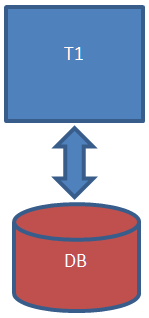
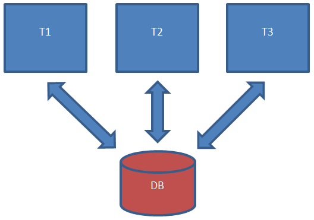

# Multi-tenancy and tenant configuration

::: info
**Note:** For Performance edition only.
:::

This page explains the architecture and configuration of a multi-tenant system using Bonita BPM.

## Platform architecture

By default, all installations of Bonita BPM create a single tenant. However multi-tenancy is possible with the Performance edition.

Multi-tenancy involves a single software installation, called a **platform**, that can serve multiple independent organizations, called **tenants**.
Each tenant is a separate, self contained configuration for a single client/company. 
Artifacts are deployed at tenant level, so a tenant has its own organization (users, groups, roles), processes (apps, cases, trasks), reports, and custom pages.
Data within a tenant is completely isolated. A tenant cannot access data from any other tenant. A user logged in to a tenant cannot access any other tenant.

After the installation of any Bonita BPM version (Community or Subscription), a single default tenant is created and ready for use.

  

If you are using the Performance edition, you can create additional tenants, using the Platform API or the REST API.
These tenants are configured with a single database. This illustration shows a platform with three tenants.



## Platform configuration

The platform is the part of the system that is common to all tenants. The platforms and tenant configurations are defined in [`$BONITA_HOME`](bonita-home.md).

The platform configuration directory is located here: `engine-server/conf/platform`.

There is a separate configuration directory for each tenant, located here: `engine-server/conf/tenants/<tenant_id>`. 
There is also a default tenant configuration, located here: `engine-server/conf/tenants/template`.

## Tenant creation

A tenant can be created using the Java PlatformAPI (see the [Javadoc](http://documentation.bonitasoft.com/javadoc/api/${varVersion}/index.html)) or the [platform REST API](platform-api.md).

**Note:**
If business objects will be deployed in the newly created tenant do not forget to [create the business data database and configure specific data sources](database-configuration-for-business-data.md).

### Java PlatformAPI

The Java PlatformAPI creates the tenant by updating the database and creating the `bonita/server/tenants/*` files. 
The following example code uses the Engine Java APIs to create a tenant called "myNewTenantName":
```groovy
// Get platform login API using the PlatformAPIAccessor
PlatformLoginAPI platformLoginAPI = PlatformAPIAccessor.getPlatformLoginAPI();
// Log in to the platform
PlatformSession platformSession = platformLoginAPI.login("platformAdmin", "platform");

// Get the platform API
PlatformAPI platformAPI = PlatformAPIAccessor.getPlatformAPI(platformSession);

// Create a new tenant
TenantCreator tenantCreator = new TenantCreator("myNewTenantName");
tenantCreator.setUsername("install");
tenantCreator.setPassword("install");
long tenantId = platformAPI.createTenant(tenantCreator);
platformAPI.activateTenant(tenantId);

// Log out of the platform
platformLoginAPI.logout(platformSession);
```

This creates the server-side configuration files in Bonita Home, but it does not create the client part of the bonita\_home for the tenant, which are required for the Bonita BPM Portal to work. 
You need to copy these files from the Bonita Home client tenant template into the newly created tenant, and configure the settings (if you need specific settings):

* Create a directory nammed with the identifier of the newly created tenant in `$BONITA_HOME/client/tenants/`
* Copy all the content from `$BONITA_HOME/client/platform/tenant-template/` into `$BONITA_HOME/client/tenants/TENANT_ID` (where TENANT\_ID is the tenant identifier)
* If you need specific settings (for example for authentication), you can configure your tenant in `$BONITA_HOME/client/tenants/TENANT_ID/conf`

### REST API

The [platform REST API](platform-api.md) calls the Java PlatformAPI to create the tenant. 
It also creates the web elements that are required for the Bonita BPM Portal to work with multitenancy, notably the `bonita/client/tenants/*` files. You do not need to copy any files manually.

## Tenant access

A tenant is identified by an id, which is used to log in and to retrieve the tenant. A tenant also has a name. You can use the tenant name to retrieve the tenant id.

### Bonita BPM Portal

In order to access Bonita BPM Portal desktop and mobile application, add the parameter `tenant=TENANT_ID` (where TENANT\_ID is the tenant identifier) in the URL before you login.

Example for Bonita BPM Portal desktop version and tenant 2:  
http://localhost:8080/bonita/login.jsp?tenant=2

Example for Bonita BPM Portal mobile version and tenant 2:  
http://localhost:8080/bonita/mobile/?tenant=2

### Bonita APIs

Use the [PlatformAPI](javadoc.md) to perform operations on tenants.

Example: retrieving a tenant from its name and log into it
```java
// Get platform login API using the PlatformAPIAccessor
PlatformLoginAPI platformLoginAPI = PlatformAPIAccessor.getPlatformLoginAPI();
// Log in to the platform
PlatformSession platformSession = platformLoginAPI.login("platformAdmin", "platform");

// Get the plaform API
PlatformAPI platformAPI = PlatformAPIAccessor.getPlatformAPI(platformSession);
// Retrieve your tenant by name
Tenant tenant = platformAPI.getTenantByName("myTenant");

// Log out of the platform
platformLoginAPI.logout(platformSession);

// Get the login API using the TenantAPIAccessor
final LoginAPI loginAPI = TenantAPIAccessor.getLoginAPI();
// Log in to the tenant
final APISession apiSession = loginAPI.login(tenant.getId(), "install", "install");

// TODO: Perform some operations on the tenant...

// Log out of the tenant
loginAPI.logout(apiSession);
```

## Pause and resume a tenant

To perform certain maintenance operations (notably when updating the business data model), you must pause the BPM service of a tenant. The 
TenantAdministrationAPI contains the following methods related to pausing a tenant:

* `TenantAdministrationAPI.isPaused()` returns true if the Tenant BPM service is paused.
* `TenantAdministrationAPI.pause()` pauses the tenant BPM service.
* `TenantAdministrationAPI.resume(`) resume the tenant BPM service.

For example, to resume the service in a tenant:
```java
TenantAdministrationAPI tenantAdministrationAPI = TenantAPIAccessor.getTenantAdministrationAPI(apiSession);
if (tenantAdministrationAPI.isPaused()) {
    tenantAdministrationAPI.resume();
}
```

While service is paused in a tenant, only the following methods are valid:

* IdentityAPI method calls
* ProfileAPI method calls
* themeAPI method calls
* TenantAdministrationAPI method calls

If you attempt an operation that is not permitted while a tenant is paused, a `TenantIsPausedException` is thrown.

You can also pause and resume a tenant using the 
[REST API](platform-api.md) or [Bonita BPM Portal](pause-and-resume-bpm-services.md).
