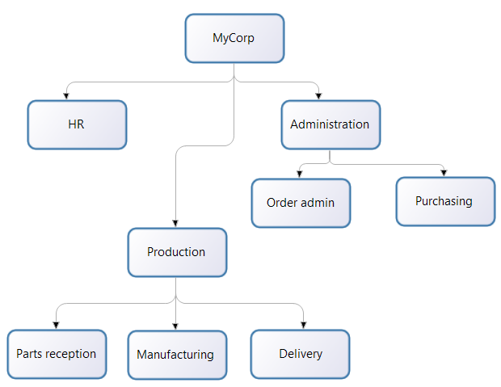
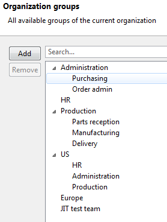

# 1.9 Organization overview

There are two stages to specifying who will perform a step
in a process:

1. When the process is designed, the designer
designates an _actor_ for the step. An
actor is a placeholder that defines the theoretical user who will perform the
step.
2. Before a process is deployed, the actors are
mapped to the real _users_ in an
organization.

This page explains the concepts of actors and organizations in Bonita BPM.
[Actors and users](#Actors_and_users)  
[What is an organization?](#What_is_an_organization)  
[Tools for managing an organization](#Tools)  
[Custom user information](#custuserinfo)  
[Organization schema XSD file](#XMLSchema)

## Actors and users

When you define a process, you define who will carry out a
step in the process by specifying an actor. For example, if a step can be done
by any member of the HR team, you could call the actor _hr_, or if a step can only be done by the sales team manager in
Europe, you could call the actor _sales\_mgr\_europe_.

A user is a person who has a username and a password in a Bonita BPM organization, and can therefore perform steps in a process. 
Before you deploy a process, you need to [map the process actors](/actors.md#Mapping_an_actor). This mapping defines who can carry out steps in the process. 

## What is an organization?

An organization is a collection of users, usually defined in
a hierarchical structure that is aligned with the structure of the business
entity that the users belong to.

Within the organization, users belong to one or more groups.
For each group a user belongs to, the user has a role. You can define roles as
required. The combination of a group and a role for a user is called a
membership. A user can have several
memberships but each one must apply to a different group.

The structure of MyCorp

In this corporation, there is a hierarchical structure, with
the following units:

MyCorp  
MyCorp/Administration  
MyCorp/Administration/Purchasing  
MyCorp/Administration/Order admin  
MyCorp/HR  
MyCorp/Production/Parts reception  
MyCorp/Production/Manufacturing  
MyCorp/Production/Delivery

These hierarchical units can be used as groups within the
Bonita BPM organization. In addition, you can create transverse groups that do
not correspond to the hierarchical structure, or that also take account of some
other factor, such as location. For example, suppose that MyCorp has two sites,
one in the US that is corporate headquarters and production, and one in Europe
that is just a production site. You could create two groups, MyCorp/US and
MyCorp/Europe, each containing the users at the relevant site.

A group can be
created based on any set of criteria useful to a process. For example, if
MyCorp is conducting trials of a new process to control just-in-time parts
delivery from a supplier, you could create a group that contains the specific
users involved in the trials. The figure below shows the groups in the MyCorp organization, seen in Bonita BPM Studio.

Organization goups in MyCorp

All the users who participate in a process must be in the
same Bonita BPM organization. For example, if you use a process to track order
processing with a supplier, the supplier employees who perform steps in the
process must be in the organization.

## Tools for managing an organization

The Bonita BPM model for managing an organization assumes that you use the same organization information
for other tools and that it is stored in an LDAP directory. Bonita BPM has three tools you can use to manage your organization
information:

* [LDAP synchronizer](/ldap-synchronizer.md) (in the Performance, Efficiency, and Teamwork editions of Bonita BPM), for 
keeping the Bonita BPM organization synchronized with your external LDAP directory. Synchronization is one-way, from LDAP to Bonita BPM. You can run the synchronizer once to
load the organization then manage it within Bonita BPM Portal, or you can run the synchronizer on a schedule and manage the organization externally.
* **Bonita BPM Portal**, for managing organization information in production within Bonita BPM. You can manage users, groups, and roles. You can also import or export the organization information.
* **Bonita BPM Studio**, for creating your initial organization definition, which must be imported into Bonita BPM Portal prior to production, 
and for managing organization information while you test a process in development. Bonita BPM Studio contains an example organization, called ACME.
This organization contains a small number of users,
who belong to different groups with realistic roles. You can use this sample organization to test a process
that you develop. 
You can modify the ACME organization and you can create other organizations.

## Custom user information

Custom user information enables custom details to be added to a user in the Organization.

### In Bonita BPM Studio:

Use the **Custom** tab in **Organization users** to add Custom information to a user. 
This [custom information is defined in Bonita BPM Studio](/custom-user-information-in-bonita-bpm-studio.md#howtoadd),
then applied to an actor filter, and when deployed in Bonita BPM Portal, enables the filtering of users mapped to tasks.

The custom user information is saved in the Organization schema and published so it can be used in Bonita BPM Portal.

The **Users with Custom information** actor filter is provided by default, and can be applied to an actor. 
It uses the custom information added to a user to map users to perform tasks in Bonita BPM Portal.
When the process is deployed in Bonita BPM Portal in a production environment, the filter definition is static, so it cannot be changed. 
However, the value associated with a filter definition can be modified by a user with an admin profile. 
The organization will be modified on the remote server. This enables tasks to be re-assigned to users in processes that are already deployed,
which is then used to filter users for tasks.

See [custom user information in Bonita BPM Studio](/custom-user-information-in-bonita-bpm-studio.md) for setting the definition and values for the filter

### In Bonita BPM Portal:

This custom information can only be seen and [edited](/custom-user-information-in-bonita-bpm-portal.md) by users who have the Administrator profile.

Note that if the custom user information does not exist in Bonita BPM Studio, modifying its value for a user in Bonita BPM Portal will not make any difference to the filter, apart from creating an error. 
Synchronize the Organization between Bonita BPM Studio and Bonita BPM Portal first by publishing it so all values are up to date.

## Organization schema XSD file

If you want to modify the organization by hand, it is important to respect the structure of the .xsd file. 
You can see the [standard Bonita BPM organization .xsd file](https://github.com/bonitasoft/bonita-engine/blob/master/bpm/bonita-core/bonita-process-engine/src/main/resources/bos-organization.xsd) on Github, 
to view the xml structure and tags.