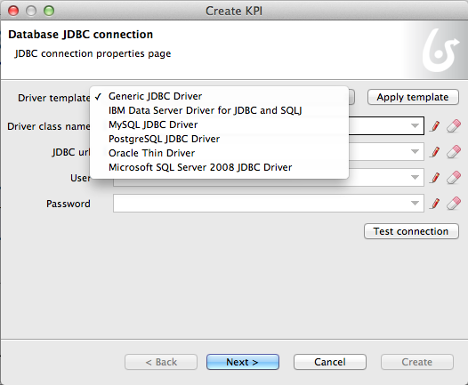
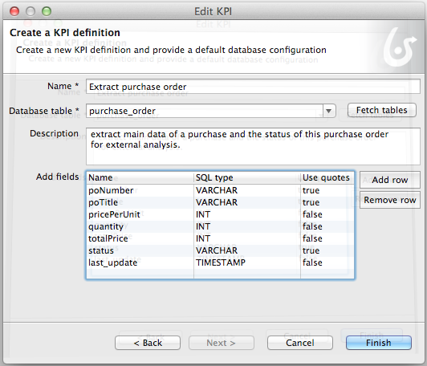

# 1.10.3 Set up KPIs

This page presents two implementation options for creating KPIs and integrating them to business processes:

* [Create a KPI using the Bonita BPM Studio KPI feature](#using_kpi)
  * [Create a KPI Definition](#create_kpi_definition)
  * [Attach a KPI Definition to a task or a pool](#attach_kpi_definition)
  * [Configure the JDBC driver as a process dependency](#add_jdbc_driver)
* [Create a KPI using a database connector](#using_connector)

## Create a KPI using the Bonita BPM Studio KPI feature

This implementation option is preferred if you do not wish to manipulate database connection settings and SQL queries manually when writing your KPI data. 
The Bonita BPM Studio assists you in setting your connection and automatically generates the SQL insertion queries for you.

Keep in mind that this implementation option has some drawbacks:

* You can only insert one row at a time. There is no dynamic multi-row insert.
* You do not benefit from pooled database connections. This has an impact on performance.

In order to use the KPI feature, you need to:

1. Create a KPI definition
2. Attach the KPI definition to a task or to a pool
3. Configure the JDBC driver as a process dependency

### Create a KPI definition

When creating a KPI definition, you must specify its database connection settings and its structure.

1. In Bonita BPM Studio, open the **KPI** menu and select **Create KPI**.
2. Fill in the database JDBC connection settings:
  1. Choose the _Driver template_ that matches your reporting database type:  

  2. Click on the **_Apply template_** button. This pre-fills the _Driver class name_ and _JDBC URL_ fields.
  3. Update the configuration with your database name, user name, and password:  

  4. Click on **_Test connection_** to validate your settings.
  5. Click on **_Next_**.
3. Fill in the KPI Definition page
  1. Provide a name for the KPI definition. This is used as a reference for the Bonita BPM Studio developers.
  2. Click on the **_Fetch tables_** button to select the table to which you wish to attach this KPI. 
This pre-fills the KPI fields based on your database structure. Alternatively, you can type the name of the database table.
  3. Optionally, specify a description (for documentation purpose only).
  4. Add/remove or update your KPI fields by specifying:
    * the name (database column name)
    * the SQL type as defined in the database
    * whether the values should be surrounded with quotes in the SQL insertion query

  5. Click on **_Create_**.

### Attach a KPI Definition to a task or a pool

Once you have specified a KPI Definition, you may to attach it multiple times and at different levels:

* _Pool level_ - This generates KPI data either at process start or end
* _Task level_ - This generates KPI data either at task start or end

Follow these instructions to attach a KPI:

1. In Bonita BPM Studio, either select a task or a process pool.
2. In the **Details** panel, **Execution** tab, **KPIs** pane, click on the **_Add_** button.
3. Select your KPI Definition from the list
4. Click on **_Next_**.
5. Review your database connection settings and test your connection (these are imported from your KPI definition so they should be correct).
6. Click on **_Next_**.
7. Fill in the Advanced configuration page
  1. Make sure the **Database table** name is correct (this field is preloaded from your KPI Definition so it should be correct).
  2. Select the **Error behavior** if KPI generation fails: you can either put the process into an error state, or ignore the failure.
  3. Pick a KPI insertion event relative to the object to which you are attaching the KPI (task or pool).
  4. Select an **Edition mode** for the insertion query. **Graphical mode** benefits from the mapping that you have provided in the KPI Definition,
**Manual mode** will let you write an SQL query.
8. Assuming that you have chosen the **Graphical mode** and clicked on **_Next_**, then configure the KPI field mapping.
9. Add as many rows as there are KPI fields in your Definition. For each row:
  * Expand the drop-down menu and choose a KPI field from your Definition.
  * Specify its value with an expression (a constant, a parameter, or a variable).
10. Click on **_Finish_**.

### Configure the JDBC driver as a process dependency

When your KPIs are attached to your process, add a JDBC driver dependency to your process.

1. In Bonita BPM Studio, select your process pool and click on **_Configure_** in the coolbar.
2. Select **Process dependencies** from the list on the left.
3. Check the .jar file of the JDBC driver that matches your reporting database.
4. Click on **_Finish_**.

Your process is now ready to be deployed. 
Reporting data will be generated in the reporting database each time the KPIs are triggered.

## Create a KPI using a database connector

This implementation option is preferred for performance and flexibility reasons:

* It enables dynamic multi-row insertions, because you can use Groovy scripts to transform data and generate complex queries.
* It benefits from pooled database connections for improved performances.

The disadvantage with this implementation option is that it requires basic SQL knowledge because you have to write insertion queries manually.

To configure this option, use a [database connector](/database.md) to insert a row in the reporting database.

Use the datasource database connector with connection pooling for improved performance.