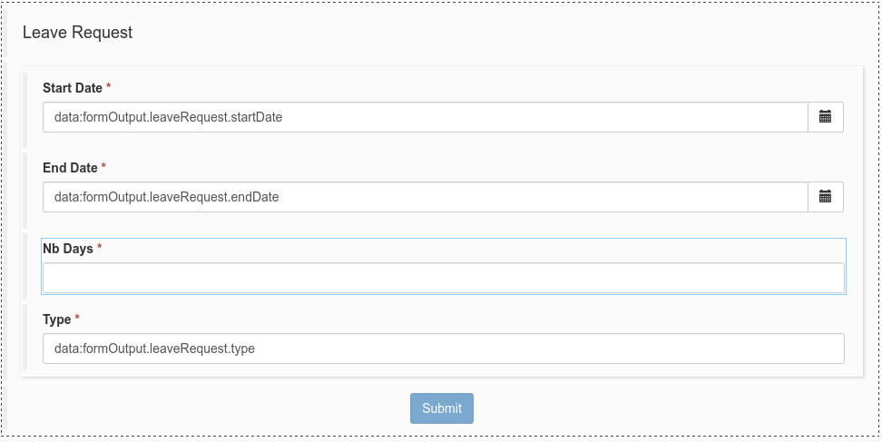
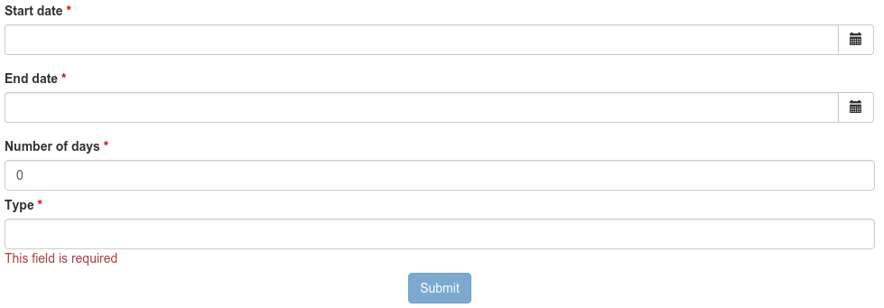
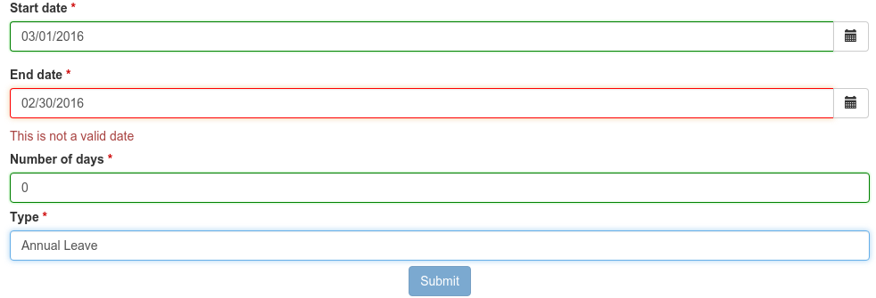
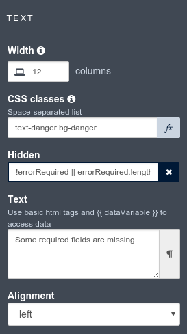
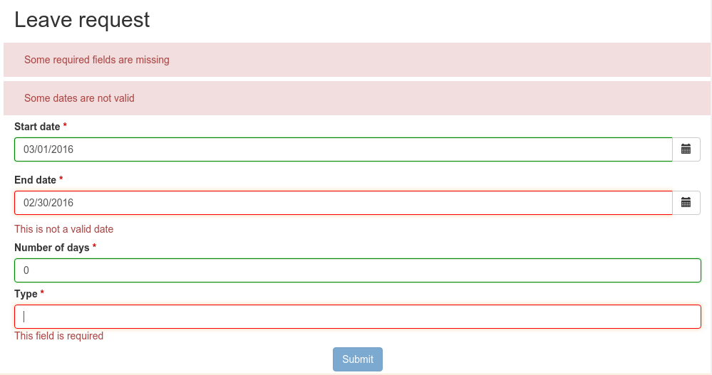
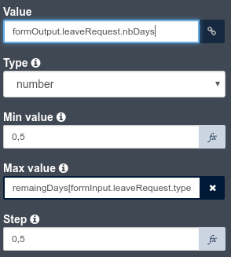
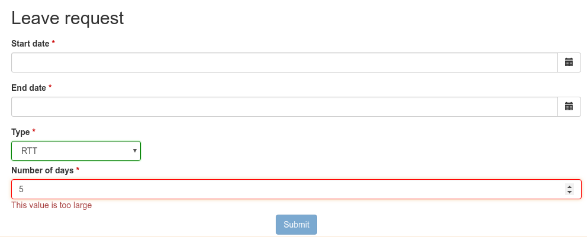

# Using forms in UI Designer

Using the Leave Request Process example, we will see how to take advantage of form and their validation inside the UI Designer.

## Prologue

We want to design a simple leave process using BonitaBPM.

First thing's first, we need to design a business object that will hold our process data. In the case of this leave request, the business object has 4 attributes:
* _startDate_: the date on which your vacation begins
* _endDate_: the date on which your vacation ends
* _nbDays_: the number of days in vacation
* _type_: type of vacation (Annual leave, anticipated,...)

On a second step, we create a leave request process where a business object will be instanciated for each process instance.

In the **Data Panel** from the pool, add _business variable_ named leaveRequest of the **LeaveRequest** type we have just created.

We then create a contract that the instantiation data must fulfill to start a process. In **Execution Pane > Contract tab**, we use the _Add from data..._ button to generate a contract from an existing business variable.  
A complex entry is created representing our _leaveRequest_ business variable input.

Each entry of the contract is bound to a business object property:
* _startDate_ as a **DATE**
* _endDate_ as a **DATE**
* _nbDays_ as an **INTEGER**
* _type_ as **TEXT**

We have something like this:

For more information about the notions of Process, Business Data Management and contract, check out [**Business Data Management and contract, Designing Efficient BPM Applications: A Process-Based Guide for Beginners**](http://shop.oreilly.com/product/0636920039402.do).

## Generated Form from Contract

Once this contract has been defined, we click on the pen icon on **Panel > Instantiation Form** it will redirect you to the UI Designer platform with a generated form.

This form has been built a form container with 4 widgets inside, matching the contract :

* a date picker widget for the start date
* a date picker widget for the end date
* a input widget expecting a number for the number of days
* a input widget expecting text for the type

The form in the editor looks like this :

You can check what it will look like once deployed by clicking on preview.

You can notice that:

- Every field label is followed with a red star showing that those fields are mandatory (required by the contract).
- The _Submit_ button is disabled as long as every fields marked as mandatory are filled.

If one of the input constraints is invalid, an error message is displayed below the input field. In our example, required fields are the only input constraints and we can see error message when editing and resetting a field. 

Once each field has a value, the form can be submitted and the process can be instantiated if the contract is validated.

## Advanced contract validation and constraints

### More visible information of invalid inputs

Now, we would like to alert the user that a input in not valid with a red border arround invalid inputs. In order to do this, we will use the AngularJS form control properties.

#### AngularJS $form

Inside a form container, AngularJS provides a special variable called $form.  
This variable holds the validation state of the different inputs, selects and textareas of the current form container. 

Here is an extract from the [AngularJS documentation site](https://docs.angularjs.org/guide/forms) that explains the purpose of this feature:

>From an AngularJS point of view, a form is a collection of controls for the purpose of grouping related controls together.
>
>Form and controls provide validation services, so that the user can be notified of invalid input before submitting a form. This provides a better user experience than server-side validation alone because the user gets instant feedback on how to correct the error.

A control in AngularJS exposes properties for a given input, select or textarea and associate it with a CSS class :
- $dirty (CSS class _ng-dirty_): the control has been interacted with
- $pristine (CSS class _ng-pristine_): the control hasn't been interacted with yet
- $valid (CSS class _ng-valid_): the model is valid
- $invalid (CSS class _ng-invalid_): the model is invalid

_Note_: In this example, we will only focus on these properties. More properties and information about form control is available on [AngularJS form guide](https://docs.angularjs.org/guide/forms).

AngularJS sets these different CSS class on HTML input elements depending on there state. 

#### Using AngularJS form control CSS classes

_Note_: A dedicated tutorial about [CSS assets in UI Designer](tuto-de-camille-CSS.html) is available and is recommended to be read before further reading.

So we want to alert our users about the invalidity of an input when it has been edited.  
These invalid elements will hold the _ng-invalid_ and _ng-dirty_ classes that we can use on a CSS file we add as asset.

We create a _validationStyle.css_ file containing the class below and add it to the page assets:

    .ng-invalid.ng-dirty {
       border-color: red;
       outline: 0;
       -webkit-box-shadow: inset 0 1px 1px rgba(0,0,0,.075),0 0 8px rgba(233,175,102,.6);
       box-shadow: inset 0 1px 1px rgba(0,0,0,.075),0 0 8px rgba(233,175,102,.6);
    }

If we only use the _ng-invalid_ class, the inputs would be red bordered even before the user enters a value to the input and that can be annoying.

In the same way, we want to show the user which inputs are valid. So we edit the CSS file to add:

    .ng-valid {
       border-color: green;
       outline: 0;
       -webkit-box-shadow: inset 0 1px 1px rgba(0,0,0,.075),0 0 4px rgba(102,233,102,.6);
       box-shadow: inset 0 1px 1px rgba(0,0,0,.075),0 0 4px rgba(102,233,102,.6);
    }

When editing, our forms looks like this:

Notice that the properties of the form controls also apply to the $form variable.  
So in our case, the $form variable has the properties $invalid, $valid, $pristine and $dirty dependending on the value of each of its control: if one of the control has a property set to true then the $form matching property id set to true.

Thus, the HTML form element has the associated ng-pristine, ng-dirty, ng-valid and ng-invalid classes set whether the $form properties are true or false.  
As our HTML form element has no border, the CSS classes we added do not have any impact on it.

### Error summary panel _(SP only)_

We will now add a panel at the top of the page listing the different errors that exists in the form. 

We create a fragment upon which the $form.$error object will be bound to. Set **errorPanel** to the fragment name and create one exposed variable called _errors_. Create two other variable : 

 * errorRequired: it allows to tell if the form has some required data not filled.
 * errorDate: it allows to tell if the form has some invalid date filled.

For these two variables, we initiate them as Javascript Expression with the following value for the _errorRequired_ field:

    return ($data.errors.required || []).filter(function(field){
        return field.$dirty;
      }).map(function(field){
        return field.$name;
      });

and for the _errorDate_ field:

    return ($data.errors.date || []).map(function(field){
        return field.$name;
      });

The _errorRequired_ is a bit different from _errorDate_ because in the case where the form is empty, we should not alert the user that some fields are missing.  
Thus, we need to filter the errors only to those which are dirty (i.e. which have been edited).

These two variables will contain the list of field name that are invalid.  
Currently, these names are not usable directly because they are automatically generated. Thus, displaying them is not very usefull.

We create two text widgets on this fragment with the following text: 

 * Some required fields are missing.
 * Some date fields are invalid.

On both widget, we add the bootstrap's _text-danger_ and _bg-danger_ CSS classes in the CSS classes property. It will put the text and the backgroundin red.

Then we need to hide these fields when no error are detected. 

In the **Hide** property of each widget evaluated as expression, we add respectively: 

 * _!errorRequired || errorRequired.length === 0_
 * _!errorDate || errorDate.length === 0_

 

We change the default style for the **p** html tag to have a little more margin. add the following to the _validationStyle.css_ file :

    .text-danger p {
      margin: 1em;
    }

Back to our leave request form, we add the fragment we have created to the top of the form. We also add a title widget above the fragment with text 'Leave request'.  
And now, our form looks like this :

### Using a select widget to the Leave request type

We want to restrict the possible choices of the user concerning the type input. He needs to choose between a predefined list of values:

 * Annual leave
 * Anticipated annual leave
 * RTT
 * Other

We remove the generated input widget for _type_ to add a select widget with the following properties :

 * Label: _Type_
 * Required: _yes_
 * Placeholder: _type_
 * Available values: _Annual leave, Anticipated annual leave, RTT, Other_
 * Value: _formOutput.typeContract_

## Custom validation

### Use contract response

At this stage, we added some simple control over the different inputs. We will now add more advanced checks. Specifically, we must ensure the following:

 * The start date must be before or equal to the end date
 * The number of days must be greater than zero
 * The type must be one of the RTT, Annual leave or other.

For the second and the last requirement, we have added a control on the input and change the type input to a select box.  
Thus, this means a user cannot submit some wrong inputs on those two requirements.  
But we need to keep in mind that while client-side validation plays an important role in providing good user experience, it can easily be circumvented and thus can not be trusted. Server-side validation is still necessary for a secure application.

For this reason, we need to add some constraints to the contract validation on studio side, one for each rule:

The server error response message on submit when one of the constraints fails has a _explanations_ attribute.  
This attribute is an array of the error message of each constraint that has failed.

On the UI Designer side, we catch the error response message on submit using a new variable called _instantiationErrorResponse_ and we bind it to the **Failed response value** property of the submit button.

Below the form title, we add a container that will iterate over the error messages and display each error message in red.

To do so, add a **Container** with _instantiationErrorResponse.explanations_ set on the **Collection** property.  
Inside this container, we add a text widget with _text-danger_ and _bg-danger_ in the **CSS classes** property and _{{$item}}_ in the text property.

Go back to the studio and launch the process to test the form error messages on submit.  
Setting a start date after the end date will produce the following screen (given that other fields are set correctly).

### Use frontend validation

We know 2 more constraints to add to our leave request form :
 * _nbDays_ must be more than 0 and less than a value retrieved externally
 * _type_ with value other display a _comment_ field limited to 100 characters

#### Number input value control

We want to help the user filling out the form and indicate him that the number of days is valid according to the amount of days he has. 

We create a new variable _remainDays_ that calls an external API that provide the number of remaining days for each leave request type (RTT and Annual leave).  
In our case, we will simply create a JSON variable to test our form and which value looks like this :

    {
      "RTT": 2,
      "Annual leave": 12
    }

Then, on the **Number of days** input widget, we edit the **Min value** to set 0.5 as the minimal value for this property and edit the **Max value** property to set `remaingDays[formInput.leaveRequest.type]`.  
Doing this allows to validate the number of days value according to the leave request type.

We also change the inputs order for it to fill more natural (type input before number of days input).

The form control of the number days input widget now exposes two new CSS classes for the validity of the input : **ng-invalid-min** and **ng-invalid-max**. In the same way, the $error will hold the attributes **min** and **max** when value is below minimum value or above maximum value respectively.

On our form, if we set a wrong input in the _number of days_ after setting the _type_ to **RTT**, it looks like this :

#### Text input value control

We assume a _comment_ attribute has been added to our business data model **LeaveRequest** and a matching contract input name _comment_.
This _comment_ must be filled when the type of the leave request is _Other_. 

Therefore, we add text area input widget to the right of the type widget.  
We change the **Hidden** property to an expression and set `formInput.leaveRequest.type !== 'Other'` for the widget to display only when type _Other_ is selected.  
We also change the **Required** property to an expression and set to `formInput.leaveRequest.type === 'Other'` to make it required when it is displayed. 

We set `Comment` as the **Label** property value and `formInput.leaveRequest.comment` to the **Value** property.

We want to force the user to enter some text that will not be too long to review but not to small.  We add some form control on this widget by setting values to _5_ to **Value min length** and _100_ to **Value max length**.

The form control of the _comment_ text area  widget now exposes two new CSS classes for the validity of the input : **ng-invalid-minlength** and **ng-invalid-maxlength**.  
In the same way, the $error will hold the attribute **minlength** and **maxlength** when the text length is below minimum length or above maximum length respectively.

When we test our form with incorrect comment, it will look like this :

